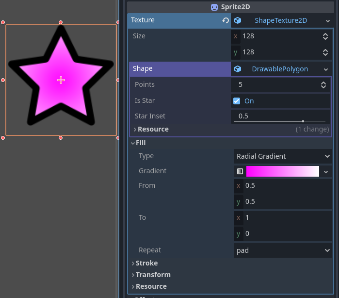
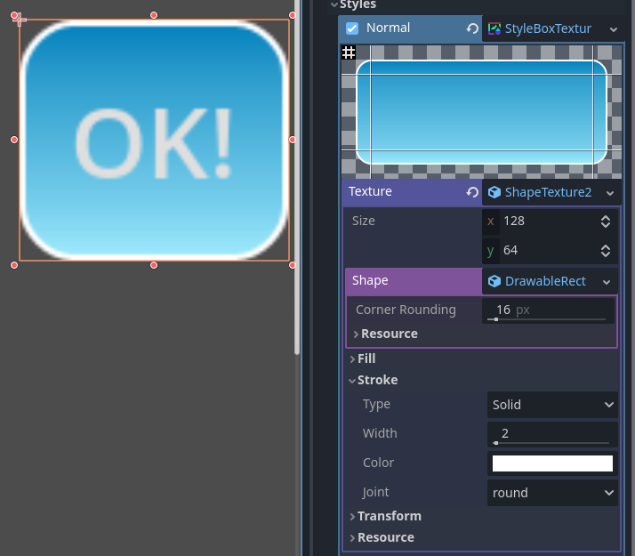

# ShapeTexture2D
A Godot addon for creating simple shape textures. Compatible with Godot 4.2 and newer. Useful for prototype/placeholder textures, particle effects and GUI elements like buttons, icons and panels. Supports gradients for both fill and strokes (border).
Following shapes are supported:
* Regular polygon (`DrawablePolygon`)
* Star (`DrawablePolygon` with `is_star` enabled)
* Ellipse (`DrawableEllipse`)
* Box with rounded corners (`DrawableRectangle`)
* Capsule (`DrawableCapsule`)

## Using ShapeTexture2D
* Install by downloading the project and copying `addons` folder into your project. (coming soon to Godot Asset Library)
* This addon doesn't act as a plugin, so no extra steps required for enabling ShapeTexture2D.
* Add any node that uses a texture (for example, `Sprite2D`).
* Set texture as "New ShapeTexture2D".
* Choose your shape (anything except DrawableShape2D, that's an abstract base class).
* Adjust the shape properties and fill and stroke type and color and enjoy!
  
  
